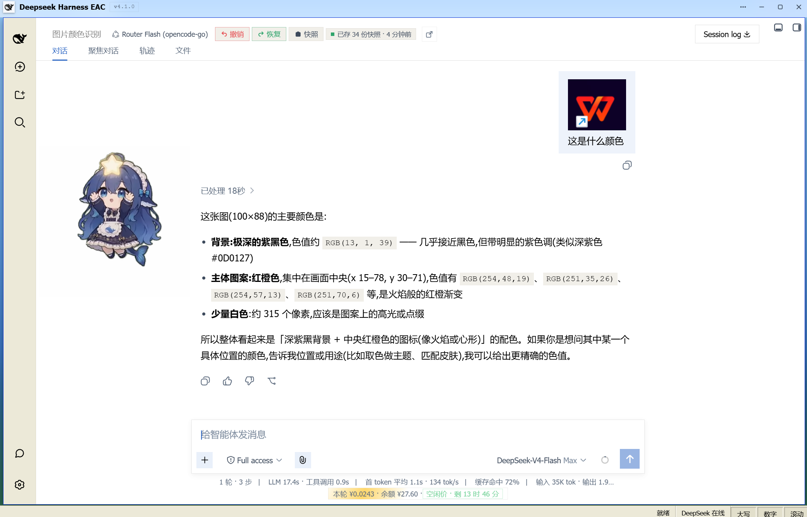
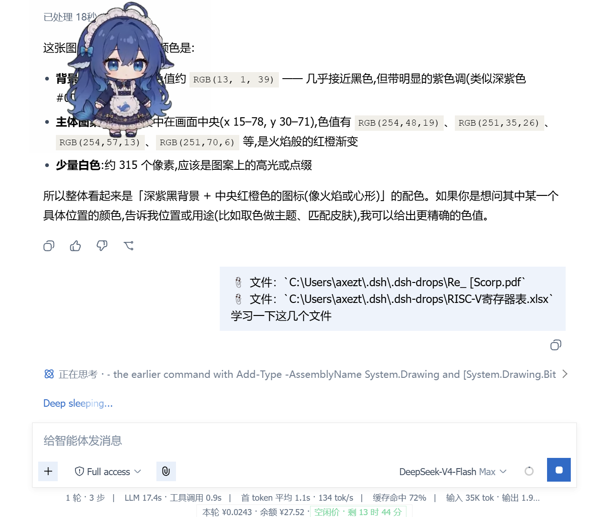
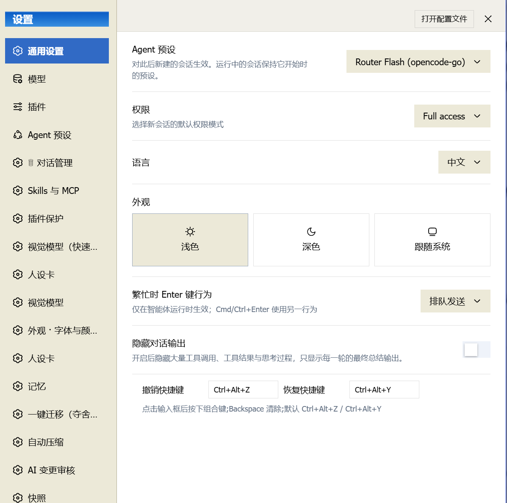

# 👁️ dsh-vision-hub — 给 DeepSeek Harness EAC 装上眼睛的视觉全家桶

> **一个仓库,三件利器**:像素级视觉工具 × 桥接内联预览 × 拖拽文件上传。
> 让纯文本的 DeepSeek 主模型真正"看得见"——图片进得来、看得懂、用得好。

纯文本模型(如 deepseek-v4-flash)天生看不见图。EAC 的请求管道又严格要求
"请求必须从会话日志推导",塞一张图进去,整个回合直接报错。dsh-vision-hub
用一套优雅的组合拳解决这件事:**桥接 → 下沉 → 工具化**,图片被无声地
"翻译"成模型能读的线索,再交给视觉模型逐像素看个明白。

---

## 🧩 三大组件

### 1️⃣ `tool-vision/` — 像素级视觉工具箱(增强版 dsh-tool-vision 0.4.0)

**一个 OpenAI 兼容端点,驱动 15 个视觉工具**——不搞模型路由、不搞降级链、
不搞独立设置页,你的 GLM 配置就是全部:

| 工具 | 一句话 |
|---|---|
| `inspect_image` | 看图问答的基础款,`[图片: 路径]` 标记的官方搭档 |
| `vision_describe` | 看图问答 / 多图对比,可要结构化 JSON |
| `vision_ground` | 像素级定位:告诉我"那个按钮"的精确坐标 |
| `vision_detect` | 把图里的元素全部点名:按钮、输入框、图标…带编号 |
| `vision_crop` | 按原图像素裁剪放大,细节看不清楚?裁出来看 |
| `vision_pixel_diff` | 逐像素对比两张图,差异比例 + 热图 + 最差区域 |
| `vision_colors` | 主色提取,给"照着图还原 UI"提供调色板 |
| `vision_ocr` | 图片文字转写,专注文字,不编造 |
| `vision_long_screenshot_ocr` | 长截图分块转写,聊天记录/长文档一键变 Markdown |
| `vision_trace` | 图标/Logo 矢量化,输出真彩色 SVG |
| `vision_extract_foreground` | 纯色背景抠图,一秒出透明 PNG |
| `vision_html_screenshot` | 本地 HTML 无头渲染截图(禁网,安全) |
| `vision_screenshot` | 桌面截屏,还能顺带识别屏幕内容 |
| `vision_present` | 把生成/导出的图片正式展示给用户 |
| `vision_materialize` | 附件落盘成真实文件路径 |

**增强版相对上游的诚意**(详见 [`docs/ENHANCEMENTS.md`](docs/ENHANCEMENTS.md)):

- ✨ **对话干净**:桥接标记从一大段指令瘦身为 `[图片: 路径]`,使用规则下沉到
  系统提示层,模型照读、界面不脏;
- 🛡️ **内容安全识别**:图片被端点安全策略拒绝时返回明确的
  `VISION_CONTENT_FILTERED`,告诉你"换张图",而不是一脸茫然;
- 🔁 **限流自动重试**:免费端点 429/5xx 自动退避,高峰期照样干活;
- 🐛 **修掉了一批上游 bug**:Uint8Array 编码、导出文件 NTFS 冒号陷阱、
  长截图无预算失控、缓存串模型、大文件 OOM…能修的都修了;
- 🔒 **安全加固**:路径逃逸拦截、HTML 截图禁网、导出防覆盖、启动清理。

### 2️⃣ `bridge-preview/` — 桥接内联预览(0.1.1)

桥接把图片变成了文本标记,预览插件再把标记变回**图片**——对话里
`[图片: …]` 那行字在图像加载成功后自动隐藏,只留下清爽的内联缩略图,
点击可放大(灯箱)。新老标记格式都认,加载失败自动降级不捣乱。

### 3️⃣ `file-drop/` — 拖拽文件上传(1.0.0)

视觉管图,它管"其余一切文件":PDF / Word / Excel / ZIP / 文本,拖进来或
点上传——桌面壳直取原始路径,无壳环境上传到工作区换回路径。与视觉桥接
天然互补:图片走视觉,文档走路径,各得其所。

---

## ⚡ 快速开始(5 分钟上手)

1. **装**:把 README「交给 Agent 安装」的提示词发给任意 AI 助手,或手动装入
   profile(详见 [docs/INSTALL.md](docs/INSTALL.md));
2. **配**:把「交给 Agent 配置」的提示词发过去,或自己改
   `$DSH_HOME/settings.yaml` 的 `tool-vision` 段(端点见 [docs/presets.md](docs/presets.md));
3. **用**:
   - 粘贴一张图 → 对话里出现 `[图片: 路径]` 短标记 + 气泡内联缩略图;
   - 问模型「图里是什么」→ 模型自动调用 `inspect_image` 看图回答;
   - 需要像素级操作 → 让模型用 `vision_ocr`(读字)/ `vision_colors`(取色)/
     `vision_ground`(定位)/ `vision_crop`(裁剪)……(全部工具见
     [docs/examples.md](docs/examples.md));
   - 拖 PDF/Word 进来 → `file-drop` 直接换成路径给模型。

> 全部设置热加载,通常无需重启;只有**安装/升级代码后**才需要重启 dsh。

---

## 📸 效果一览







---

## 🚀 安装

三个组件各自独立,按需取用:

```bash
# 视觉工具箱(tool-vision 增强版)
dsh plugin add xing666173/dsh-vision-hub # 子目录:tool-vision/

# 桥接内联预览
dsh plugin add xing666173/dsh-bridge-preview

# 拖拽文件上传
dsh plugin add xing666173/dsh-file-drop
```

> 依赖:视觉工具箱需要 `sharp` / `potrace` / `puppeteer-core`(缺失时工具
> 自动降级并提示安装命令,不影响其他工具)。

### 🤖 交给 Agent 安装(复制即用)

大多数人都是让 agent 帮忙装——把下面这段提示词直接发给你的 agent 即可
(在 DSH 对话里、或任意能执行命令的 AI 助手都行):

```text
请帮我安装 dsh-vision-hub 视觉全家桶(https://github.com/xing666173/dsh-vision-hub),
包含三个组件:增强版 dsh-tool-vision(视觉工具箱)、dsh-bridge-preview(桥接内联预览)、
dsh-file-drop(拖拽文件上传)。

安装步骤:
1. 把仓库克隆或下载到本地,或者直接按子目录取文件:
   - tool-vision/ → 增强版 dsh-tool-vision(覆盖我当前的内置/已安装版本)
   - bridge-preview/ → 桥接内联预览插件
   - file-drop/ → 拖拽上传插件
2. 三个组件都安装到我的 DSH profile(默认 web-desktop):
   - 视觉工具箱:dsh-tool-vision 需要正确的 package.json(name=dsh-tool-vision)、
     lib/ 目录、vendor/ 目录、cordis.patch.yml;依赖 sharp/potrace/puppeteer-core/
     @deepseek-ai/schemastery 需要装进 profile 的 node_modules(或保证可解析)。
   - bridge-preview 与 file-drop:按各自包结构安装并挂载。
3. 在 profile 的 cordis.patch.yml 中确认三个插件的挂载行存在(或按包内
   cordis.patch.yml 自动挂载)。
4. 如果我的桌面是 EAC(内置插件机制),请同步到
   resources/app/assets/plugins/ 对应目录,保证重启后不被覆盖。
5. 完成后提示我重启 dsh。

不要修改任何设置项,安装完即可。
```

### 🤖 交给 Agent 配置(复制即用)

安装完成后,把这段发给 agent 帮你配好视觉端点(把 `YOUR_API_KEY`
换成你的密钥;没有密钥就问我要):

```text
请帮我配置 dsh-vision-hub 的视觉模型(保持 EAC 原生设置,不要新增设置页):

1. 在 $DSH_HOME/settings.yaml 的 tool-vision 段写入(没有该段就创建):
   tool-vision:
     baseURL: https://open.bigmodel.cn/api/paas/v4
     model: glm-4v-flash
     maxTokens: 1024
     apiKeyEnv: GLM_API_KEY
     apiKey: YOUR_API_KEY
     bridgeTextOnly: true
     requestGuard: true
2. 如果 profile 的 cordis.patch.yml 里有 tool-vision 挂载行,保持其
   config 与上面一致(bridgeTextOnly/requestGuard)。
3. 检查依赖 sharp/potrace/puppeteer-core 可被插件解析;缺失时安装并说明。
4. 不要改动其他任何配置;改完告诉我是否需要重启。

说明:全部设置热加载,通常无需重启;只有安装新代码时才需要重启 dsh。
```

> 💡 想换视觉端点?任意 OpenAI 兼容 `/chat/completions` 都行——改
> `baseURL` + `model` + `apiKey` 三项即可(例如阿里百炼
> `https://dashscope.aliyuncs.com/compatible-mode/v1` + `qwen3-vl-flash`)。

## ⚙️ 配置

视觉工具箱的设置全部在 **EAC 原生设置页**(设置 → 视觉模型),12 项配置
热加载即时生效,无需重启。核心三项:

```yaml
tool-vision:
  baseURL: https://open.bigmodel.cn/api/paas/v4   # 任意 OpenAI 兼容端点
  model: glm-4v-flash                              # 视觉模型
  apiKey: sk-xxxx                                   # 你的密钥
```

更多细节见 [`docs/ENHANCEMENTS.md`](docs/ENHANCEMENTS.md)(新增与修改、适配性、EAC 平台适配度)与 [`docs/COMPARISON.md`](docs/COMPARISON.md)(与上游对比)。另有 [README.en.md](README.en.md) 英文版。

---

## 🙏 致谢

这个仓库不是从零开始,而是站在巨人的肩膀上重新打磨:

- **DeepSeek Harness EAC** —— 感谢平台本身的开放架构:内置插件机制、
  `agent/pre-step` 桥接缝、原生设置体系、系统提示装配,让"外挂眼睛"成为
  可能;也感谢 EAC 作者与 DeepSeek 团队对纯文本模型的坚持——正是这份
  坚持,催生了这套桥接方案。
- **Scorp1o117 / [dsh-tool-vision](https://github.com/Scorp1o117/dsh-tool-vision)**
  —— 视觉桥接与 `inspect_image` 的原作者。我们在此基础上移植了 14 个像素
  级视觉工具、重构了桥接链路、做了大量稳定性与安全修复,但桥接的骨架与
  设计思路始终是他的。
- **ysr666 / [dsh-vision-router](https://github.com/ysr666/dsh-vision-router)**
  —— 14 个 `vision_*` 工具的设计者。我们保留了他的工具语义(提示词、
  参数契约、像素后处理),砍掉了重型架构,让工具在单一端点下轻装上阵。
- **dsh-bridge-preview 与 dsh-file-drop** —— 本仓库维护者(xing666173)
  自己编写/适配的两个配套插件。

没有上游的开放与慷慨,就没有今天的全家桶。感谢每一位把代码开源出来的
开发者。❤️

---

## 📄 License

MIT — 三方署名与致谢:[Scorp1o117](https://github.com/Scorp1o117)(dsh-tool-vision)
· [ysr666](https://github.com/ysr666)(dsh-vision-router)
· [xing666173](https://github.com/xing666173)(增强与维护)。详见 [LICENSE](LICENSE)。
